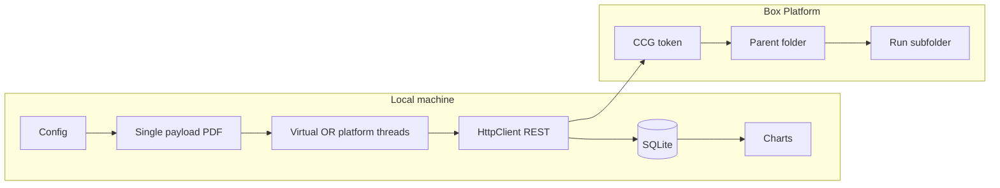
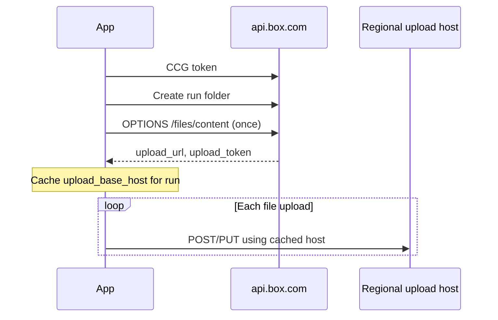

# Product Requirements Document (PRD)

## Box Upload Performance Framework

| Field | Value |
|-------|--------|
| **Product name** | Box Upload Performance Framework |
| **Repository** | [box-uploader-framework](https://github.com/jacquesvandermerwe/box-uploader-framework) |
| **Version** | 0.8 (draft) |
| **Status** | Draft |
| **Last updated** | 2026-05-17 |

---

## 1. Executive summary

The Box Upload Performance Framework is a **local-first, Java-based load and measurement tool** whose purpose is to stress-test and characterize upload throughput and latency to [Box.com](https://www.box.com) under controlled, repeatable conditions.

The application prepares **one valid, readable PDF** per run (fixed byte size), reuses that file for every upload in the run, creates a **dedicated Box subfolder** under the configured parent folder for that run, and uploads each copy with an **application-generated GUID** as the remote file name. Uploads use **single-stream** or **chunked** Box APIs based on a configurable size threshold; **each chunk HTTP call** is recorded separately, while a completed chunked upload’s metrics are persisted in **one SQLite transaction**. Metrics and **network timing** live in **SQLite**, with **summary statistics** (min/avg/max upload time, ancillary request counts, 429 counts, P95/P99) and **charts** for performance diagnosis. Authentication is **CCG**.

**Box API access uses direct HTTP (REST) only** — not the official Box Java SDK — so client-side SDK overhead cannot distort measurements.

Runs are driven by **saved configuration profiles** (repeatable) or an interactive **setup wizard** when no profile or config file is supplied. The wizard collects all inputs step-by-step and offers to **save** the configuration for future runs.

This is not a production uploader or sync client. It is a **benchmark harness** optimized for accurate throughput measurement and latency analysis.

---

## 2. Problem statement

Teams integrating with Box need to understand how upload performance behaves under:

- **Virtual threads** or **platform threads** (one mode per run, never mixed)
- Different file counts and consistent payload size
- API rate limits and intentional throttling
- Batched upload patterns

Today, ad-hoc scripts and SDK-based clients produce inconsistent metrics, hide per-phase latency, and rarely capture **network-level timing** or **every ancillary API call**. This framework standardizes workload, authentication, persistence, and visualization so results are comparable across runs.

---

## 3. Goals and non-goals

### 3.1 Goals

| ID | Goal |
|----|------|
| G1 | Run entirely on the **local machine** with minimal operational overhead |
| G2 | Maximize **upload throughput** while exposing **per-call and per-file latency** |
| G3 | Support **exactly one concurrency mode per run**: **virtual threads** *or* **platform threads** (mutually exclusive) |
| G4 | Use **one reusable PDF** per run with **consistent size** for all uploads |
| G4b | Create a **run-scoped Box folder** under the supplied parent folder |
| G4c | Name each uploaded file with an **application GUID**; record Box file ID separately in metrics |
| G5 | Authenticate via **Box CCG** for unattended runs |
| G5b | Support **chunked uploads** with **per-chunk metrics** and **atomic SQLite persistence** per completed file |
| G5c | Use **Box Zones** via **one preflight per run** to resolve the regional upload host for all files in the run folder |
| G6 | Persist **every API call** and **network metrics** in **SQLite** |
| G7 | Produce **summary statistics** and **charts** for performance diagnosis |
| G8 | Use **direct HTTP** to Box APIs for minimum client-side measurement noise |
| G9 | Sample **CPU load** and **network bandwidth** during runs for correlation with upload performance |
| G10 | **Save and reuse** named configuration profiles; **wizard** when no config is provided |

### 3.2 Non-goals (v1)

| ID | Non-goal |
|----|----------|
| NG1 | Multi-tenant SaaS or cloud-hosted control plane |
| NG2 | Download, search, or collaboration beyond the upload path |
| NG3 | Rich desktop GUI for live monitoring (terminal wizard + post-run HTML charts only) |
| NG4 | Official Box Java SDK in the upload hot path |
| NG5 | Multiple different PDF payloads within a single run |
| NG6 | Upload of arbitrary user file types (generated PDF only for v1) |

---

## 4. Technology constraints

| Constraint | Requirement |
|------------|-------------|
| **Language** | **Java only** (mandatory) |
| **JDK** | **Java 21 or higher** (21 LTS minimum; newer LTS supported) |
| **Build** | Maven or Gradle; reproducible builds |
| **Runtime** | Local OS (macOS, Linux, Windows) |
| **Box API** | [Box Platform REST APIs](https://developer.box.com/reference/) via **`java.net.http.HttpClient`** (JDK built-in; **no OkHttp** in v1) |
| **HTTP client** | **`java.net.http.HttpClient` only** — no third-party HTTP libraries (OkHttp, Apache HttpClient, etc.) on the upload/auth path |
| **Box SDK** | **Must not be used** for upload/auth hot path |
| **Persistence** | **SQLite** (embedded, local file per run or shared DB with `run_id`) |
| **Charts** | Generated locally (e.g. HTML + embedded chart library, or PNG via plotting library) — no external SaaS |
| **Auth** | **Client Credentials Grant (CCG)** only for v1 |

### 4.1 Rationale for Java 21+

- **Virtual threads** for high fan-out I/O-bound uploads
- **`HttpClient`** with HTTP/2, precise interceptors/timing hooks
- Modern language features for maintainable benchmark code

### 4.2 Rationale for direct HTTP (no SDK)

| Concern | Decision |
|---------|----------|
| SDK adds buffering, retries, or abstraction layers | Avoid; measure raw request timing |
| SDK version skew across environments | Eliminate variable |
| Per-call granularity | Implement explicit phases in application code |
| Accuracy principle | **Default and only v1 path: REST over `HttpClient`** |

### 4.3 HTTP client: native `java.net.http.HttpClient` (no OkHttp)

**Decision:** v1 uses the **JDK’s native `java.net.http.HttpClient` only**. OkHttp and other third-party HTTP libraries are **not** used.

**v1 must record DNS, TCP, and TLS timings for every `api_calls` row** (in addition to TTFB and transfer). These are **required**, not optional or deferred to v2.

| Capability | v1 requirement | How (native Java) |
|------------|----------------|-------------------|
| CCG, uploads, chunking | Required | `HttpClient` + `BodyPublisher` |
| `duration_ms` (total RTT) | Required | `System.nanoTime()` around `send()` |
| `transfer_ms` | Required | Custom `BodyPublisher` / `BodySubscriber` |
| **`dns_lookup_ms`** | **Required** | Timed resolution via `InetAddress` / resolver hook; `0` when connection reused from pool (see below) |
| **`tcp_connect_ms`** | **Required** | Measured in custom `Socket` / `SocketChannel` connect wrapper used by the client SSL stack |
| **`tls_handshake_ms`** | **Required** | Measured in custom `SSLSocket` wrapper (`startHandshake` → handshake complete) |
| `time_to_first_byte_ms` | Required | Time from request send complete to first response header byte |
| Connection reuse | Supported | On reuse: `dns_lookup_ms = 0`, `tcp_connect_ms = 0`, `tls_handshake_ms = 0`; flag `connection_reused = 1` |

**Instrumentation approach (v1, no OkHttp):**

`HttpClient` does not expose DNS/TCP/TLS callbacks directly. v1 originally implemented a thin **`NetworkTimingContext`** (ThreadLocal or request-scoped, later consolidated/removed to simplify the call path) populated by:

1. **DNS** — Before opening a new connection to a host, time `InetAddress.getAllByName(host)` (or cache per-host DNS time for the first resolution in a run).
2. **TCP** — Custom `SocketFactory` / `SocketImpl` or `SocketChannel` connect wrapper that records connect start/end.
3. **TLS** — Custom `SSLSocketFactory` delegating to the default factory, wrapping `SSLSocket` to time the handshake.
4. Wire factories into `HttpClient.newBuilder().sslContext(...)` / connection layer per TDD.

On **pooled connection reuse**, phase times for DNS/TCP/TLS are **zero** and `connection_reused` is set so charts distinguish cold vs warm connections.

**Explicit non-goals for HTTP layer:**

- OkHttp, Apache HttpClient 5.x, Retrofit, Feign, or Box SDK for uploads

---

## 5. Personas and use cases

| Persona | Use case |
|---------|----------|
| **Platform engineer** | Compare virtual vs platform threads at fixed concurrency |
| **Integration developer** | Validate CCG and folder targeting before production |
| **Performance analyst** | Query SQLite + review charts for P95/P99 and 429 spikes |
| **Network engineer** | Inspect DNS/TCP/TLS/TTFB breakdowns per call |
| **QA / release** | Regression gate on summary metrics stored in SQLite |

---

## 6. Functional requirements

### 6.1 Workload: single PDF per run

| ID | Requirement | Priority |
|----|-------------|----------|
| FR-1 | Generate **exactly one** PDF per run at a **configurable target size** (`pdf.targetSizeBytes`) | P0 |
| FR-2 | PDF must be **valid** (opens in standard readers without repair) | P0 |
| FR-3 | PDF must be **readable** (structured text content, not random binary padding) | P0 |
| FR-4 | **Same file bytes** are reused for every upload in the run (re-open or share read-only handle) | P0 |
| FR-5 | PDF is stored under configurable **`work.parentDirectory`** (e.g. `work/payload.pdf`) | P0 |
| FR-6 | Size must remain **consistent** across the run (verify byte length before and after run) | P0 |
| FR-7 | Each upload is assigned an **`uploadGuid`** (UUID generated by the application) used as the **Box file name** (e.g. `{uploadGuid}.pdf`) | P0 |
| FR-8 | The **Box file ID** returned by the API is stored separately as `boxFileId` in metrics — it is **not** used as the filename | P0 |
| FR-9 | All HTTP calls for one logical upload share the same `uploadGuid` | P0 |

### 6.2 Workload: upload execution

| ID | Requirement | Priority |
|----|-------------|----------|
| FR-10 | At run start, **create a new Box folder** as a child of **`box.parentFolderId`**; all uploads for the run go into that folder | P0 |
| FR-11 | Store `boxRunFolderId` in the `runs` table; optional cleanup can delete the entire run folder | P1 |
| FR-12 | **Upload strategy** is chosen from payload size vs **`upload.chunkedUploadThresholdBytes`**: below threshold → **single-stream** upload; at or above → **chunked** session upload | P0 |
| FR-13 | **`upload.chunkSizeBytes`** is configurable (default **50 MiB**); each part uses this size except the final part | P0 |
| FR-14 | **Each chunk upload** (`UPLOAD_PART`) produces its own row in `api_calls` with `chunk_index`, offset, and byte length | P0 |
| FR-15 | A **fully committed** chunked upload (session create → all parts → commit) persists all related `api_calls` rows and the `file_uploads` row inside **one SQLite transaction** | P0 |
| FR-16 | Failed or aborted chunked uploads **roll back** the SQLite transaction for that file (no partial committed metrics for incomplete uploads) | P0 |
| FR-17 | Perform **one upload preflight per run** (not per file) after the run folder is created; cache the resolved **zone upload base URL** for all uploads in that run | P0 |
| FR-18 | Preflight uses the **run folder ID**, **payload byte size**, and a **probe file name** (see §9.3.2); do **not** repeat preflight for each `uploadGuid` | P0 |
| FR-19 | Each file upload uses the cached zone base; **do not** reuse a single preflight `upload_url` verbatim if it contains a one-time session id (parse host/base only) | P0 |
| FR-20 | Configurable **`upload.fileCount`** (number of upload operations per run) | P0 |
| FR-21 | Configurable **`upload.concurrency`** (max in-flight uploads) | P0 |
| FR-22 | **`upload.threadMode`**: `VIRTUAL` **or** `PLATFORM` only — **mutually exclusive** | P0 |
| FR-23 | Platform mode uses fixed pool size = `upload.concurrency` (or explicit `upload.platformThreadPoolSize` if set) | P0 |
| FR-24 | Optional **rate limiting** (requests/sec or uploads/min) | P0 |
| FR-25 | Optional **bucket/batch** mode (group size + delay between buckets) | P1 |
| FR-26 | Graceful shutdown with configurable drain timeout | P1 |
| FR-27 | Configurable retry policy; each retry attempt is a **new row** in `api_calls` (included in the file’s transaction only if the upload ultimately succeeds) | P1 |

### 6.3 Post-upload deletion (optional)

| ID | Requirement | Priority |
|----|-------------|----------|
| FR-35 | **`cleanup.deleteBoxRunFolderAfterRun`**: optional delete of the **entire run folder** (and contents) on Box when run completes | P1 |
| FR-36 | **`cleanup.deleteLocalPayloadAfterRun`**: optional delete of local PDF when run completes | P1 |
| FR-37 | **Default for all cleanup flags: `false`** | P0 |

### 6.4 Authentication (CCG)

| ID | Requirement | Priority |
|----|-------------|----------|
| FR-30 | Authenticate via Box **CCG** using **client ID, client secret, and enterprise ID** supplied by the active profile or wizard session | P0 |
| FR-31 | **Do not read** CCG credentials from environment variables; source is **profile file** or **wizard** only | P0 |
| FR-31b | Profile files containing secrets live under `profiles.directory`, are **never committed to git**, and use restrictive OS file permissions | P0 |
| FR-32 | Token request is a measured HTTP call stored in SQLite | P0 |
| FR-33 | Fail fast with clear errors on invalid CCG config | P0 |

### 6.5 Configuration, profiles, and setup wizard

| ID | Requirement | Priority |
|----|-------------|----------|
| FR-40 | CLI with subcommands: `run`, `wizard`, `profile` (`list`, `show`, `delete`) | P0 |
| FR-41 | All tunables in §7 settable via **saved profile**, **`--config` file**, **CLI flags**, or **wizard** | P0 |
| FR-42 | Pre-run validation (Java ≥ 21, folder ID, paths, thread mode, chunk settings) | P0 |
| FR-43 | Log effective config at run start (secrets redacted); persist `profile_name` on `runs` when applicable | P0 |
| FR-44 | **Saved profiles**: named YAML files under configurable profiles directory (default `~/.box-upload-perf/profiles/`) | P0 |
| FR-45 | `run --profile <name>` loads a saved profile and executes (repeatable benchmarks) | P0 |
| FR-46 | `run --config <path>` loads an arbitrary YAML file (one-off or CI) | P0 |
| FR-47 | `run` with **no** `--profile` or `--config` launches the **interactive setup wizard** | P0 |
| FR-48 | Wizard is a **multi-step** terminal flow (see §7.1); supports **Back**, **defaults**, and **review** before run | P0 |
| FR-49 | At end of wizard: option to **run immediately**, **save as new profile**, or **both** | P0 |
| FR-50 | Saved profiles **include** `box.clientId`, `box.clientSecret`, and `box.enterpriseId` so runs are repeatable without env vars | P0 |
| FR-51 | `profile list` shows name, description, last-modified; `profile show` prints YAML with **`clientSecret` redacted** | P0 |
| FR-51b | Wizard **prompts for** client ID, client secret (masked input), and enterprise ID; writes them into the profile on save | P0 |
| FR-52 | Wizard offers to **load and edit** an existing profile as a starting point | P1 |
| FR-53 | Optional `profile.description` and tags in profile metadata for documentation | P2 |

### 6.6 Metrics, SQLite, summaries, and charts

| ID | Requirement | Priority |
|----|-------------|----------|
| FR-70 | **Every HTTP call** in the upload path persisted to SQLite before run ends | P0 |
| FR-71 | **Network timing** captured per call: **DNS, TCP, TLS, TTFB, and transfer** — all **required** in v1 (see §4.3, §11) | P0 |
| FR-72 | When a pooled connection is reused, set `connection_reused = 1` and DNS/TCP/TLS times to **0** for that call | P0 |
| FR-73 | Compute and store **run summary** row(s) in SQLite after run completes | P0 |
| FR-74 | Generate **chart artifacts** under `run.outputDirectory` (see §12) | P0 |
| FR-75 | Flag **HTTP 429** on any call; include `Retry-After` when present | P0 |
| FR-76 | Classify calls as **primary** (`UPLOAD_SIMPLE`, each `UPLOAD_PART`) vs **ancillary** (auth, folder create, session create, commit) | P0 |
| FR-77 | Add chart for **per-chunk upload latency** when `upload_strategy = CHUNKED` | P0 |
| FR-78 | Sample **CPU load** at a configurable interval during the upload phase; persist to SQLite | P0 |
| FR-79 | Record **application upload bandwidth** per call and as rolling aggregates during the run | P0 |
| FR-80 | Sample **host network interface bandwidth** (bytes in/out per second) at the same interval | P0 |
| FR-81 | Include CPU and bandwidth **summary stats** in `run_summaries` and **charts** overlaid with upload throughput | P0 |
| FR-82 | Optional export of SQLite tables to JSON/CSV for external tools | P2 |

---

## 7. Configuration reference

| Parameter | Type | Description | Default |
|-----------|------|-------------|---------|
| `box.clientId` | string | CCG client ID | wizard / profile (**required**) |
| `box.clientSecret` | string | CCG client secret | wizard / profile (**required**) |
| `box.enterpriseId` | string | Enterprise ID | wizard / profile (**required**) |
| `box.userId` | string | Optional comma-separated user IDs for `As-User` impersonation (enterprise token) | — |
| `box.parentFolderId` | string | Parent folder; app creates a **child run folder** here | required |
| `box.runFolderName` | string | Name for run subfolder; default `{runId}` | `{runId}` |
| `upload.chunkedUploadThresholdBytes` | long | Payload size **below** this uses single-stream; **at or above** uses chunked | `52428800` (50 MiB) |
| `upload.chunkSizeBytes` | long | Part size for chunked uploads | `52428800` (50 MiB) |
| `work.parentDirectory` | path | Local working directory | `./work` |
| `work.payloadFileName` | string | Local PDF filename | `payload.pdf` |
| `upload.fileCount` | int | Number of uploads in run | `100` |
| `upload.concurrency` | int | Max parallel uploads | `32` |
| `upload.threadMode` | enum | `VIRTUAL` or `PLATFORM` (required) | — |
| `upload.platformThreadPoolSize` | int | Platform pool size; defaults to `concurrency` | — |
| `upload.rateLimitPerSecond` | double | Client throttle; `0` = unlimited | `0` |
| `upload.bucketSize` | int | Files per bucket; `0` = off | `0` |
| `upload.bucketDelayMs` | long | Pause between buckets | `0` |
| `pdf.targetSizeBytes` | long | Payload PDF size | `1048576` |
| `cleanup.deleteBoxRunFolderAfterRun` | boolean | Delete run subfolder on Box after run | **`false`** |
| `cleanup.deleteLocalPayloadAfterRun` | boolean | Delete local PDF after run | **`false`** |
| `run.runId` | string | Run correlation ID | auto UUID |
| `run.outputDirectory` | path | SQLite DB, charts, logs | `./results` |
| `metrics.sqliteFileName` | string | DB file name under output dir | `metrics.db` |
| `metrics.sampleIntervalMs` | long | CPU and host bandwidth sample period | `500` |
| `metrics.networkInterfaceName` | string | NIC to monitor; empty = default route / primary active | auto |
| `retry.maxAttempts` | int | Max retries per failed call | `3` |
| `retry.backoffMs` | long | Base backoff | `500` |
| `profiles.directory` | path | Where named profiles are stored | `~/.box-upload-perf/profiles` |

### 7.1 Configuration resolution order

When starting a run, effective settings are merged (later overrides earlier):

1. Built-in defaults (§7)
2. Saved **profile** (`--profile`) or **config file** (`--config`)
3. CLI flags (e.g. `--concurrency 64`)
4. Wizard-collected values (wizard mode only)

Exactly **one** of `--profile`, `--config`, or wizard must supply the base config. CLI flags may override non-secret fields.

### 7.2 Saved profile file format

Profiles are **YAML** files: `{profiles.directory}/<profile-name>.yaml`

```yaml
profile:
  name: virtual-100
  description: 100 files, 32 concurrent, virtual threads
  createdAt: "2026-05-17T12:00:00Z"
box:
  clientId: "your-client-id"
  clientSecret: "your-client-secret"
  enterpriseId: "987654"
  parentFolderId: "123456789"
  userId: ""   # optional; comma-separated for round-robin per upload
upload:
  fileCount: 100
  concurrency: 32
  threadMode: VIRTUAL
pdf:
  targetSizeBytes: 52428800
# ... remaining §7 keys
```

| Rule | Requirement |
|------|-------------|
| **Credentials** | `clientId`, `clientSecret`, `enterpriseId` stored **in the profile file** on disk |
| **Permissions** | On save: set profile file to **owner-read/write only** (`0600` on Unix); profiles directory `0700` |
| **Git** | `profiles.directory` and `*.yaml` profiles **must** be in `.gitignore`; never commit secrets |
| **Display** | CLI `profile show` masks `clientSecret`; logs and `runs.config_json` **redact** secret fields |
| **Name** | Filename-safe `profile.name`; unique within profiles directory |
| **Repeatability** | Same profile file → same credentials and settings (`runs.profile_name`) |
| **Not used** | Environment variables for CCG credentials (**explicitly disabled**) |

### 7.3 Interactive setup wizard (no config provided)

Launched when: `box-upload-perf run` (no args) or `box-upload-perf wizard`.

**UI:** Terminal-based, step-by-step (JLine3 or similar in TDD). Works in standard macOS/Linux/Windows terminals.

| Step | Title | Collects |
|------|--------|----------|
| 1 | **Start** | New setup / load existing profile / exit |
| 2 | **Box credentials** | `clientId`, `clientSecret` (masked), `enterpriseId`, optional comma-separated `userId` |
| 3 | **Box target** | `parentFolderId` |
| 4 | **Workload** | `fileCount`, `pdf.targetSizeBytes` |
| 5 | **Concurrency** | `threadMode`, `concurrency`, optional `platformThreadPoolSize` |
| 6 | **Chunking** | `chunkedUploadThresholdBytes`, `chunkSizeBytes` (sensible defaults shown) |
| 7 | **Optional** | Rate limit, bucket mode, cleanup flags, output directory, sample interval |
| 8 | **Review** | Summary table (secret masked); confirm or go back |
| 9 | **Finish** | **Run now** / **Save profile** (prompt for name + description) / **Both** |

Wizard validates each step before advancing. Optional **Test connection** on step 2 performs a CCG token request using entered credentials before continuing.

### 7.4 CLI examples

```bash
# Repeatable run from saved profile
box-upload-perf run --profile virtual-100

# One-off config file
box-upload-perf run --config ./configs/staging.yaml

# No config → wizard
box-upload-perf run

# Wizard only (save profile without running)
box-upload-perf wizard --save-only

# Manage profiles
box-upload-perf profile list
box-upload-perf profile show virtual-100
box-upload-perf profile delete virtual-100
```

### 7.5 CCG credential storage (profile & wizard only)

| Question | Answer |
|----------|--------|
| **Where is Client ID stored?** | In the **profile YAML** under `box.clientId`, or entered in the **wizard** and written there on save |
| **Where is Client Secret stored?** | In the **profile YAML** under `box.clientSecret` (plaintext on disk, protected by OS permissions) |
| **Default location** | `~/.box-upload-perf/profiles/<profile-name>.yaml` |
| **Environment variables?** | **Not used** — the app does not read `BOX_CLIENT_ID` / `BOX_CLIENT_SECRET` |
| **SQLite / logs / charts?** | **Never** — only redacted copies in `config_json` and logs |
| **Wizard without save** | Credentials kept **in memory** for the current run only; lost when the process exits unless user saves a profile |

**Loading order for a run:**

1. `run --profile <name>` → load `~/.box-upload-perf/profiles/<name>.yaml` (includes credentials)
2. `run --config <path>` → load that YAML file (includes credentials)
3. `run` (wizard) → user enters credentials in step 2; if they save a profile, same YAML path as above

---

## 8. Concurrency model

Each run selects **exactly one** thread model. Mixing virtual and platform threads in the same run is **not supported**.

### 8.1 Virtual threads (`upload.threadMode = VIRTUAL`)

- Executor: `Executors.newVirtualThreadPerTaskExecutor()`
- One virtual thread per in-flight upload task (subject to concurrency semaphore)
- **Use when:** maximizing I/O concurrency with low OS thread footprint

### 8.2 Platform threads (`upload.threadMode = PLATFORM`)

- Fixed-size `ThreadPoolExecutor` with size = `upload.platformThreadPoolSize` or `upload.concurrency`
- **Use when:** baseline comparison against virtual threads or investigating carrier/pinning effects

### 8.3 Comparison across runs

To compare modes, execute **two separate runs** with identical config except `threadMode`. Do not switch modes mid-run.

### 8.4 Measurement fairness

- Optional warm-up uploads excluded from summary (configurable)
- PDF generated **once** before timed upload phase; generation time excluded from per-file upload stats
- Record JVM version, `threadMode`, and concurrency in `runs` table



---

## 9. Box integration (direct REST)

### 9.1 HTTP client requirements

- Use **`java.net.http.HttpClient`** (Java 21+) with **network instrumentation** (§4.3) — **no OkHttp**
- Single shared `HttpClient` instance per run; explicit connect timeout and HTTP version
- Wrap each `client.send(...)` with monotonic timing for `duration_ms`
- Use custom **`BodyPublisher`** / **`BodySubscriber`** for **transfer_ms** and byte counts
- **Every `api_calls` row must include** `dns_lookup_ms`, `tcp_connect_ms`, `tls_handshake_ms`, `time_to_first_byte_ms`, `transfer_ms` (non-null for completed calls; `0` when connection reused)
- Attach custom **socket / SSL factories** so TCP and TLS phases are measured on **new** connections
- Request/response sizes from headers and body publishers (no third-party Box SDK)

### 9.2 Run folder creation

1. After CCG token acquisition, call Box API to **create folder** `box.runFolderName` (default: `runId`) under `box.parentFolderId`.
2. Persist `box_run_folder_id` in `runs` before any uploads.
3. All uploads target `box_run_folder_id`, not the parent directly.
4. If folder creation fails, the run aborts with no uploads.

### 9.3 Box Zones and preflight (once per run)

Box **Zones** (data residency) affect which **regional upload host** serves your traffic (e.g. `upload-las.app.box.com` vs `upload.box.com`). Box returns zone-aware URLs via [preflight check](https://developer.box.com/guides/uploads/check) (`OPTIONS /files/content`) and via `session_endpoints` on chunked sessions.

Because **every file in a run** shares:

- the same **run folder** (`box_run_folder_id`),
- the same **payload size** (one reusable PDF), and  
- the same **enterprise / storage policy** context,

the framework performs **exactly one preflight per run** — not per file.

#### 9.3.1 When preflight runs



| Step | Action |
|------|--------|
| 1 | Authenticate (CCG) |
| 2 | Create **run subfolder** under `box.parentFolderId` |
| 3 | **Preflight once** against `box_run_folder_id` |
| 4 | Upload all files using cached **zone upload base** |

#### 9.3.2 Preflight request (representative)

`OPTIONS https://api.box.com/2.0/files/content` with headers/body equivalent to:

| Field | Value for preflight |
|-------|---------------------|
| `name` | Probe name, e.g. `.box-perf-preflight-probe.pdf` (not a real uploaded file) |
| `size` | Actual `payload_bytes` for the run |
| `parent.id` | **`box_run_folder_id`** (not the parent folder) |

File names differ per upload (`{uploadGuid}.pdf`), but preflight’s purpose here is **zone / upload-host resolution** and quota checks for that folder + size — not per-name collision testing for every GUID.

#### 9.3.3 What is cached from the response

| Cached field | Use |
|--------------|-----|
| `upload_base_url` | Parsed scheme + host + `/api/2.0` from `upload_url` (e.g. `https://upload-las.app.box.com/api/2.0`) |
| `upload_token` | Optional; use for upload calls if returned, else main access token |
| `upload_zone_host` | Hostname only, stored on `runs` for reporting (e.g. `upload-las.app.box.com`) |

**Do not** store and replay the full `upload_url` for every file if it includes a **one-time** `upload_session_id` query parameter. Each file upload still performs its own **POST /files/content** or **POST /files/upload_sessions** against the cached **base**.

#### 9.3.4 Per upload type

| Strategy | Zone usage |
|----------|------------|
| **Single-stream** | `POST {upload_base_url}/files/content` (multipart) |
| **Chunked** | `POST {upload_base_url}/files/upload_sessions` then use **`session_endpoints`** from each session response for parts/commit (host should match zone) |

#### 9.3.5 Metrics

| Call | `phase` | Count per run |
|------|---------|---------------|
| Preflight | `PREFLIGHT_CHECK` | **1** (ancillary) |
| Simple upload | `UPLOAD_SIMPLE` | 1 × file count |
| Chunked | `UPLOAD_SESSION_CREATE`, `UPLOAD_PART`, `UPLOAD_COMMIT` | per file |

Record `upload_zone_host` on the `runs` row and include host in `api_calls.url_template` where useful for charts.

#### 9.3.6 When to re-preflight

| Scenario | Behavior |
|----------|----------|
| Normal run | Once at start of upload phase |
| Preflight fails (409/4xx) | Abort run with clear error |
| Run longer than Box session TTL (edge) | Optional config `upload.repreflightAfterMs` (P2); default **never** within a run |

### 9.4 Upload strategy selection

Decision uses **local payload byte size** (`pdf.targetSizeBytes` / measured file length), not Box’s internal limits alone:

| Condition | Strategy | REST flow (high level) |
|-----------|----------|-------------------------|
| `payloadBytes < upload.chunkedUploadThresholdBytes` | **Single-stream** | `POST /2.0/files/content` (multipart) |
| `payloadBytes >= upload.chunkedUploadThresholdBytes` | **Chunked** | Create upload session → upload parts of `upload.chunkSizeBytes` → commit session |

**Defaults:** both `chunkedUploadThresholdBytes` and `chunkSizeBytes` are **50 MiB** (`52_428_800` bytes).

Examples:

| Payload size | Threshold | Chunk size | Result |
|--------------|-----------|------------|--------|
| 10 MiB | 50 MiB | 50 MiB | Single-stream |
| 50 MiB | 50 MiB | 50 MiB | Chunked (1 part + commit, or per Box minimum part rules in TDD) |
| 120 MiB | 50 MiB | 50 MiB | Chunked (~3 parts at 50 MiB) |

### 9.5 Chunked upload metrics

| Step | `phase` | `api_calls` rows | Notes |
|------|---------|------------------|-------|
| Create session | `UPLOAD_SESSION_CREATE` | 1 | Ancillary; includes `upload_guid` |
| Upload part *i* | `UPLOAD_PART` | **1 per chunk** | Primary; `chunk_index`, `chunk_offset`, `chunk_length` |
| Commit session | `UPLOAD_COMMIT` | 1 | Ancillary; yields `box_file_id` |

Each chunk HTTP call records full **network timing** independently (supports per-chunk latency charts).

### 9.6 SQLite transaction boundary (per file)

For **each logical file upload** (`upload_index` + `upload_guid`):

```
BEGIN TRANSACTION
  INSERT api_calls (session create)     -- chunked only
  INSERT api_calls (part 0..N-1)        -- one row per chunk; chunked only
  INSERT api_calls (commit)             -- chunked only
  INSERT api_calls (simple upload)      -- single-stream only
  INSERT OR UPDATE file_uploads (success, durations, box_file_id, chunk_count)
COMMIT
```

On any failure before successful Box commit (or simple upload 201):

```
ROLLBACK
  -- optional: INSERT file_uploads with success=0 in a separate transaction for run-level failure counts
```

**Intent:** analysis never sees a “completed” chunked file in `file_uploads` unless **all** chunk rows and commit are persisted together.

Single-stream uploads use the same pattern: one `api_calls` row + `file_uploads` row in one transaction.

### 9.7 Naming uploaded files

1. Before upload, generate **`uploadGuid`** = UUID (application).
2. Box file name: **`{uploadGuid}.pdf`** (extension configurable in TDD).
3. Upload uses local `payload.pdf` bytes (same content every time; distinct Box files per `uploadGuid`).
4. On success, store Box response **`id`** as `box_file_id` in metrics (separate from filename).
5. Correlate all `api_calls` for that upload via `upload_guid`; `box_file_id` populated after success.

### 9.8 Rate limits

- Persist `status_code = 429`, `retry_after_seconds`, `rate_limited = 1`
- Include in summary: **`count_429`**

### 9.9 Ancillary (“accessory”) requests

**Ancillary** = any HTTP call that is not the primary upload body/part for a file:

- OAuth token (`AUTH_TOKEN`)
- Run folder creation (`FOLDER_CREATE`)
- Upload preflight (`PREFLIGHT_CHECK`) — **once per run**
- Upload session creation (`UPLOAD_SESSION_CREATE`)
- Upload commit (`UPLOAD_COMMIT`)
- Preflight / options (if used)

**Primary** = `UPLOAD_SIMPLE` or each `UPLOAD_PART` chunk call.

Summary must include **`ancillary_request_count`** (total ancillary calls in run).

---

## 10. PDF generation specification

1. **Once per run** before uploads start.
2. **Valid** PDF structure (`%PDF-1.x`, xref, trailer).
3. **Readable** text (run ID, size label, timestamp) via Apache PDFBox or OpenPDF.
4. **Size**: within ±2% of `pdf.targetSizeBytes` (configurable tolerance in TDD).
5. **Reuse**: uploads read the same path; no per-upload regeneration.
6. **Integrity check**: SHA-256 hash logged in `runs` table for reproducibility.

---

## 11. SQLite data model

### 11.1 Table: `runs`

| Column | Type | Description |
|--------|------|-------------|
| `run_id` | TEXT PK | UUID |
| `profile_name` | TEXT | Saved profile used, if any; null for ad-hoc `--config` |
| `config_source` | TEXT | `PROFILE`, `FILE`, `WIZARD` |
| `started_at` | TEXT | ISO-8601 UTC |
| `ended_at` | TEXT | ISO-8601 UTC |
| `box_parent_folder_id` | TEXT | Configured parent |
| `box_run_folder_id` | TEXT | Created child folder for this run |
| `box_run_folder_name` | TEXT | Folder name used on Box |
| `thread_mode` | TEXT | `VIRTUAL` / `PLATFORM` |
| `concurrency` | INTEGER | |
| `file_count` | INTEGER | |
| `payload_bytes` | INTEGER | |
| `payload_sha256` | TEXT | |
| `chunked_upload_threshold_bytes` | INTEGER | Snapshot from config |
| `chunk_size_bytes` | INTEGER | Snapshot from config |
| `upload_zone_host` | TEXT | From single preflight (e.g. `upload-las.app.box.com`) |
| `upload_base_url` | TEXT | Cached zone base used for uploads |
| `jvm_version` | TEXT | |
| `config_json` | TEXT | Redacted snapshot |

### 11.2 Table: `api_calls`

One row per HTTP request (including retries).

| Column | Type | Description |
|--------|------|-------------|
| `id` | INTEGER PK | Auto-increment |
| `run_id` | TEXT FK | |
| `upload_guid` | TEXT | Application GUID; Box filename stem |
| `box_file_id` | TEXT | From Box response after success; nullable until then |
| `upload_index` | INTEGER | 0..fileCount-1 |
| `phase` | TEXT | `AUTH_TOKEN`, `FOLDER_CREATE`, `PREFLIGHT_CHECK`, `UPLOAD_SIMPLE`, `UPLOAD_SESSION_CREATE`, `UPLOAD_PART`, `UPLOAD_COMMIT` |
| `chunk_index` | INTEGER | 0-based part index; null for non-chunk calls |
| `chunk_offset` | INTEGER | Byte offset in payload; null if N/A |
| `chunk_length` | INTEGER | Bytes in this part; null if N/A |
| `upload_strategy` | TEXT | `SINGLE_STREAM` or `CHUNKED` |
| `is_ancillary` | INTEGER | 0/1 |
| `is_primary_upload` | INTEGER | 0/1 |
| `timestamp` | TEXT | Request start UTC |
| `http_method` | TEXT | |
| `url_template` | TEXT | Path without sensitive query |
| `status_code` | INTEGER | |
| `duration_ms` | REAL | Total client-observed RTT |
| `request_bytes` | INTEGER | |
| `response_bytes` | INTEGER | |
| `upload_mbps` | REAL | `request_bytes / transfer_ms` for primary upload phases; nullable otherwise |
| `thread_mode` | TEXT | |
| `attempt` | INTEGER | |
| `rate_limited` | INTEGER | 1 if 429 |
| `retry_after_seconds` | INTEGER | Nullable |
| `error_message` | TEXT | Nullable |
| **Network** | | |
| `dns_lookup_ms` | REAL | **Required**; `0` if connection reused |
| `tcp_connect_ms` | REAL | **Required**; `0` if connection reused |
| `tls_handshake_ms` | REAL | **Required**; `0` if connection reused |
| `time_to_first_byte_ms` | REAL | **Required** |
| `transfer_ms` | REAL | **Required** — payload transfer portion |
| `connection_reused` | INTEGER | `1` if pooled connection reused (DNS/TCP/TLS = 0) |
| `total_network_ms` | REAL | Sum of phases; sanity check vs `duration_ms` |

*All network columns are **mandatory for v1**. Implementation: §4.3 (originally used `NetworkTimingContext` + socket/SSL wrappers, later consolidated). Monotonic clock: `System.nanoTime()`.*

### 11.3 Table: `file_uploads`

One row per **logical file upload** (end-to-end for one `upload_index`).

| Column | Type | Description |
|--------|------|-------------|
| `id` | INTEGER PK | |
| `run_id` | TEXT FK | |
| `upload_guid` | TEXT | Unique per file upload |
| `upload_index` | INTEGER | |
| `box_file_id` | TEXT | From Box after success |
| `upload_strategy` | TEXT | `SINGLE_STREAM` or `CHUNKED` |
| `chunk_count` | INTEGER | 0 for single-stream; N for chunked |
| `success` | INTEGER | |
| `upload_duration_ms` | REAL | Sum of primary upload time (simple or all parts) |
| `end_to_end_duration_ms` | REAL | Including session create + commit + simple |
| `ancillary_call_count` | INTEGER | Per file |
| `had_429` | INTEGER | |

### 11.4 Table: `run_summaries`

Computed at end of run.

| Column | Type | Description |
|--------|------|-------------|
| `run_id` | TEXT PK | |
| `files_attempted` | INTEGER | |
| `files_succeeded` | INTEGER | |
| `files_failed` | INTEGER | |
| **`upload_time_min_ms`** | REAL | Min per-file upload time |
| **`upload_time_avg_ms`** | REAL | Average per-file upload time |
| **`upload_time_max_ms`** | REAL | Max per-file upload time |
| **`upload_time_p95_ms`** | REAL | P95 per-file upload time |
| **`upload_time_p99_ms`** | REAL | P99 per-file upload time |
| `end_to_end_p95_ms` | REAL | Optional: includes ancillary |
| `end_to_end_p99_ms` | REAL | |
| **`ancillary_request_count`** | INTEGER | Total ancillary HTTP calls |
| **`count_429`** | INTEGER | Total 429 responses |
| `throughput_bytes_per_sec` | REAL | |
| `throughput_files_per_sec` | REAL | |
| `total_bytes_uploaded` | INTEGER | |
| `run_duration_ms` | REAL | |
| `cpu_process_avg_pct` | REAL | Mean JVM process CPU during upload phase |
| `cpu_process_max_pct` | REAL | Peak process CPU sample |
| `cpu_system_avg_pct` | REAL | Mean system CPU (if available on JVM) |
| `app_upload_mbps_avg` | REAL | Mean application upload Mbps (from `api_calls`) |
| `app_upload_mbps_peak` | REAL | Peak rolling upload Mbps |
| `nic_tx_mbps_avg` | REAL | Mean host transmit Mbps (interface sample) |
| `nic_tx_mbps_peak` | REAL | Peak host transmit Mbps |
| `nic_rx_mbps_avg` | REAL | Mean host receive Mbps |
| `nic_rx_mbps_peak` | REAL | Peak host receive Mbps |

### 11.5 Table: `resource_samples`

Time-series samples during the upload phase (background sampler thread).

| Column | Type | Description |
|--------|------|-------------|
| `id` | INTEGER PK | |
| `run_id` | TEXT FK | |
| `timestamp` | TEXT | ISO-8601 UTC |
| `elapsed_ms` | REAL | Ms since upload phase start |
| `cpu_process_pct` | REAL | JVM process CPU utilization (0–100) |
| `cpu_system_pct` | REAL | System-wide CPU (0–100); nullable if JVM unsupported |
| `nic_bytes_in_delta` | INTEGER | Bytes received on interface since last sample |
| `nic_bytes_out_delta` | INTEGER | Bytes sent on interface since last sample |
| `nic_rx_mbps` | REAL | Derived receive Mbps for interval |
| `nic_tx_mbps` | REAL | Derived transmit Mbps for interval |
| `app_bytes_uploaded_delta` | INTEGER | App-measured upload bytes since last sample |
| `app_upload_mbps` | REAL | Derived application upload Mbps for interval |
| `in_flight_uploads` | INTEGER | Current concurrent uploads |

*CPU via JMX `OperatingSystemMXBean` (JDK, no extra HTTP dependency). Host NIC counters via cross-platform OS interface reader (TDD: e.g. OSHI `oshi-core` — single small dependency for NIC stats only).*

---

## 12. Summary statistics and charts

### 12.1 Required summary statistics (FR-73)

All of the following are persisted in `run_summaries` and printed to CLI:

| Statistic | Definition |
|-----------|------------|
| **Min upload time** | Minimum `upload_duration_ms` over successful `file_uploads` |
| **Avg upload time** | Arithmetic mean of successful per-file upload times |
| **Max upload time** | Maximum per-file upload time |
| **P95 / P99** | Percentiles of per-file upload times (successful uploads) |
| **Ancillary request count** | Count of `api_calls` where `is_ancillary = 1` |
| **429 count** | Count of `api_calls` where `status_code = 429` |
| **Throughput** | Bytes/sec and files/sec over run window |
| **CPU (process)** | `cpu_process_avg_pct`, `cpu_process_max_pct` from `resource_samples` |
| **CPU (system)** | `cpu_system_avg_pct` when available |
| **Application upload bandwidth** | `app_upload_mbps_avg`, `app_upload_mbps_peak` |
| **Host NIC bandwidth** | `nic_tx_mbps_avg/peak`, `nic_rx_mbps_avg/peak` |

### 12.2 Required charts (FR-74)

Generated under `{run.outputDirectory}/{runId}/charts/` as **HTML** (self-contained, open in browser) unless PNG is also specified in TDD:

| Chart | Purpose |
|-------|---------|
| **Per-file upload time distribution** | Histogram + min/avg/max markers |
| **Upload time over sequence** | Scatter/line vs `upload_index` (spot drift, warmup) |
| **Latency percentiles bar** | P50, P95, P99, max |
| **429 timeline** | 429 events vs time or upload index |
| **Ancillary vs primary call volume** | Stacked bar per file or per phase |
| **Per-chunk upload time** | Bar/line chart of `UPLOAD_PART` duration by `chunk_index` (chunked files only) |
| **Network breakdown** | Box-whisker or stacked bar: **DNS, TCP, TLS**, TTFB, transfer (means or P95) — **required in v1** |
| **Cold vs warm connections** | Compare calls where `connection_reused = 0` vs `1` |
| **Throughput over time** | Sliding window bytes/sec (identify sustained vs burst) |
| **CPU load over time** | Process (and system if available) CPU % vs `elapsed_ms` |
| **Bandwidth over time** | Dual series: **app upload Mbps** and **host NIC tx Mbps** vs time |
| **CPU / bandwidth vs upload latency** | Optional overlay: mark P95 upload windows on CPU/bandwidth chart |

Charts read from SQLite for the completed `run_id` only.

### 12.4 CPU and bandwidth — what is measured

| Metric | Source | Answers |
|--------|--------|---------|
| **Process CPU %** | JMX `getProcessCpuLoad()` × 100 | Is the JVM CPU-bound during uploads? |
| **System CPU %** | JMX `getCpuLoad()` (platform-dependent) | Is the machine saturated? |
| **Application upload Mbps** | Sum of `request_bytes` from uploads in sample window ÷ interval | How fast is *this app* sending to Box? |
| **Per-call Mbps** | `request_bytes / transfer_ms` on each `UPLOAD_SIMPLE` / `UPLOAD_PART` | Per-request throughput |
| **Host NIC tx/rx Mbps** | Delta on chosen network interface ÷ interval | Is the network link saturated (other traffic included)? |

**Note:** Application Mbps reflects only Box upload traffic recorded by the harness. Host NIC Mbps includes all traffic on that interface (other apps, background sync). Comparing both helps separate **client/app limits** from **link saturation**.

### 12.3 Performance-issue signals

The following combinations in charts/summary indicate likely investigation areas:

| Signal | Likely cause |
|--------|----------------|
| High DNS/TCP/TLS, low transfer | Network path or TLS negotiation |
| High transfer, low TTFB | Bandwidth-saturated upload |
| Rising upload time vs index | Throttling, connection pool exhaustion |
| 429 spikes | Box rate limits; compare `count_429` across runs |
| High ancillary count per file | Chunked session overhead; file size threshold |
| Platform vs virtual thread delta | Threading model effect (compare separate runs) |
| High process CPU, low app Mbps | CPU-bound client (serialization, PDF read, TLS) |
| High NIC tx, low app Mbps | Non-Box traffic or measurement on wrong interface |
| High app Mbps, rising 429s | Hitting Box rate limits despite available bandwidth |
| Low CPU and low Mbps | Network latency, congestion, or Box-side throttle |

---

## 13. Non-functional requirements

| ID | Category | Requirement |
|----|----------|-------------|
| NFR-1 | Latency | Minimize client overhead; shared `HttpClient`, avoid unnecessary copies of payload |
| NFR-2 | Accuracy | Monotonic timing per call; document clock source in TDD |
| NFR-3 | Persistence | SQLite WAL mode; transactional inserts; survive partial runs |
| NFR-4 | Observability | SLF4J logs with `runId`, `uploadGuid`, `uploadIndex`, `boxFileId` |
| NFR-5 | Security | Secrets only in profile files (0600); never in SQLite, logs, charts, or git; `profile show` redacts secret |
| NFR-6 | Java version | Refuse to start if JVM &lt; 21 |
| NFR-7 | Reproducibility | Same config + same PDF hash → comparable throughput within documented tolerance |
| NFR-8 | Resource sampling overhead | Sampler must not materially distort upload timings; default 500 ms interval; document overhead in TDD |

---

## 13.1 Resource monitoring (CPU and bandwidth)

**Feasibility:** Yes — both are captured in **v1** on the local machine.

### CPU load

- Use JDK **`com.sun.management.OperatingSystemMXBean`** (`getProcessCpuLoad()`, `getCpuLoad()` where supported).
- Sample on a **background thread** every `metrics.sampleIntervalMs` during the upload phase.
- No extra dependency for CPU.

### Network bandwidth (two layers)

1. **Application-level (required)** — Derived from harness data:
   - Per call: `request_bytes / transfer_ms` → Mbps stored or computed on `api_calls`.
   - Per interval: rolling sum of upload bytes ÷ sample window → `app_upload_mbps` in `resource_samples`.
2. **Host / interface-level (required)** — OS network counter deltas on `metrics.networkInterfaceName`:
   - Compute `nic_tx_mbps` and `nic_rx_mbps` per sample interval.
   - Implementation in TDD may use **`oshi-core`** (recommended cross-platform NIC counters). This is the **only** optional third-party dependency for metrics (not for HTTP).

Sampler runs **in parallel** with uploads; does not block the upload hot path.

---

## 14. User flows

### 14.1 First-time user (wizard)

1. Run: `box-upload-perf run` (no config).
2. Enter **client ID**, **client secret**, and **enterprise ID** in wizard step 2 (optional **Test connection**).
3. Complete remaining steps → **Save profile** as `virtual-32` (credentials written to `~/.box-upload-perf/profiles/virtual-32.yaml`) → **Run**.
4. Review charts and SQLite under `results/{runId}/`.

### 14.2 Repeatable benchmark (saved profile)

1. Run: `box-upload-perf run --profile virtual-32`
2. Same settings as first run; `runs.profile_name = virtual-32` for traceability.
3. Compare multiple runs in SQLite/charts by `profile_name`.

### 14.3 CI / scripted run (profile or config file)

1. Store a profile YAML (with credentials) in the CI **secret store** or secure runner filesystem (not in git).
2. Run: `box-upload-perf run --profile ci-smoke` or `box-upload-perf run --config /secure/path/ci-smoke.yaml`

### 14.4 Thread model comparison

1. Save profile `virtual-100` (`threadMode: VIRTUAL`).
2. Duplicate to `platform-100` (`threadMode: PLATFORM`, same counts/size).
3. Run both profiles; compare `run_summaries` filtered by `profile_name`.

### 14.5 Core run pipeline (all entry paths)

After config is resolved (profile, file, or wizard):

1. Validate JVM ≥ 21 and configuration.
2. Generate **one** PDF → create **run folder** on Box → upload N times → SQLite → summary → charts.
3. Open `results/{runId}/charts/index.html`.

---

## 15. Success criteria

| Criterion | Target |
|-----------|--------|
| JVM | Runs on Java 21+ only |
| PDF | Single payload; 100% valid; consistent byte size for run |
| Naming | Each Box file named with application `uploadGuid`; `box_file_id` stored separately |
| Run folder | Child folder created under `box.parentFolderId` for every run |
| Upload path | Payload &lt; threshold → single-stream; ≥ threshold → chunked with per-chunk `api_calls` rows |
| Transactions | Successful chunked upload metrics committed in one SQLite transaction per file |
| HTTP | Zero Box SDK calls on upload/auth path |
| SQLite | 100% of HTTP calls recorded with DNS, TCP, TLS, TTFB, transfer |
| Summary | min/avg/max/P95/P99, ancillary count, 429 count present |
| Charts | All §12.2 charts generated, including CPU and bandwidth over time |
| CPU / bandwidth | `resource_samples` populated; summary CPU and Mbps in `run_summaries` |
| Cleanup default | No Box folder or local delete unless explicitly configured |
| CCG | Unattended run for full duration |
| Profiles | Credentials in profile YAML; re-run via `--profile`; not from env |
| Wizard | Collects and saves client ID/secret; masked display on review |

---

## 16. Risks and mitigations

| Risk | Impact | Mitigation |
|------|--------|------------|
| Box rate limits | Distorted throughput | Throttle config; chart 429s; report `count_429` |
| Socket instrumentation complexity | Incorrect phase times | TDD documents factory wiring; integration test vs known host; validate cold vs reused |
| Pooled connections hide DNS/TCP/TLS | Misread as “fast network” | `connection_reused` flag; charts split cold/warm |
| Wrong network interface | Misleading NIC Mbps | Auto-detect default; `metrics.networkInterfaceName` override |
| CPU sampler overhead | Skewed latency | 500 ms default interval; sampler on background thread only |
| Profile file exposed on disk | Credential leak | `0600`/`0700` permissions; default path under user home; document not to sync profiles to cloud |
| Profile committed to git | Credential leak in repo | `.gitignore` profiles dir; `profile validate` warns if tracked |
| Wizard UX in non-TTY CI | Hung pipeline | Detect non-interactive stdin; require `--profile` or `--config` with credentials file; exit with usage |
| Many Box files/folders accumulate | Storage/quota | Optional `deleteBoxRunFolderAfterRun`; default off |
| Partial chunked metrics | Misleading P95 | Per-file SQLite transaction; rollback on failure |
| Threshold vs Box API limits | Unexpected 4xx | Validate threshold/chunk size against Box docs in TDD |
| Virtual thread pinning | Skewed comparison | Document JVM/SSL; compare in separate runs |

---

## 17. Milestones (proposed)

| Phase | Scope | Deliverable |
|-------|--------|-------------|
| **M1** | Java 21 skeleton, config loader, profile save/load, wizard (basic steps) | Repeatable profile |
| **M1b** | CCG via REST, SQLite schema, single upload | One row in `api_calls` |
| **M2** | Single PDF generator + reuse | Consistent payload |
| **M3** | Virtual **or** platform concurrency | `threadMode` enforced |
| **M4** | Full call logging + network timings + `file_uploads` | Complete DB |
| **M5** | Chunked upload + per-chunk metrics + transactional persist | Large payload support |
| **M6** | Summaries + charts + run folder + optional cleanup | Analysis-ready run |
| **M7** | Retries, bucket mode | Hardening |

---

## 18. Resolved decisions (formerly open questions)

| # | Decision |
|---|----------|
| ~~OQ-1~~ | **Java 21+ only** |
| ~~OQ-2~~ | **Direct REST / native `HttpClient` + DNS/TCP/TLS instrumentation — no Box SDK, no OkHttp** |
| ~~OQ-3~~ | **Create child run folder** under supplied `box.parentFolderId` |
| ~~OQ-4~~ | **Delete after run: optional; default `false`** (run folder delete optional) |
| ~~OQ-5~~ | **Threshold default 50 MiB**; chunk size default **50 MiB**; validate against Box min/max part size in **TDD** |

---

## 19. Glossary

| Term | Definition |
|------|------------|
| **CCG** | Client Credentials Grant — server-to-server Box OAuth |
| **Virtual threads** | Lightweight JVM threads (Java 21+) |
| **Platform threads** | OS-backed `ThreadPoolExecutor` workers |
| **Ancillary request** | Non-primary-upload HTTP call (auth, session, commit, rename) |
| **Primary upload** | HTTP call carrying file content (simple or part) |
| **uploadGuid** | Application-generated UUID; used as Box file name |
| **Box file ID** | Identifier returned by Box; stored in metrics only |
| **Run folder** | Box subfolder created per run under the configured parent |
| **chunkedUploadThresholdBytes** | Payload size boundary: below = single-stream, at/above = chunked |
| **chunkSizeBytes** | Byte size of each uploaded part (default 50 MiB) |
| **Payload PDF** | Single local file reused for every upload in a run |
| **connection_reused** | `1` when a pooled connection is reused; DNS/TCP/TLS = 0 for that call |
| **NetworkTimingContext** | Request-scoped holder for timing (Consolidated in later revisions to simplify timing flow) |
| **Application upload Mbps** | Upload bytes sent by the harness in a time window |
| **Host NIC Mbps** | All traffic on a network interface (not Box-only) |
| **resource_samples** | Time-series table for CPU and bandwidth during a run |
| **Preflight (per run)** | One `OPTIONS /files/content` to resolve Box Zone upload host for the run folder |
| **upload_base_url** | Cached regional upload API base for all files in the run |
| **Profile** | Named saved YAML configuration for repeatable runs |
| **Setup wizard** | Interactive terminal flow when no profile/config is provided |

---

## 20. Appendix: suggested project layout

```
box-upload-performance-framework/
├── docs/
│   └── PRD.md
├── src/main/java/
│   ├── cli/
│   ├── config/         # Profile loader, wizard
│   ├── wizard/
│   ├── box/          # REST client (no SDK)
│   ├── http/         # HttpClient + DNS/TCP/TLS instrumentation
│   ├── pdf/
│   ├── upload/
│   ├── metrics/      # SQLite + summaries + resource sampler
│   └── charts/
├── config/
│   └── config.example.yaml    # Example only; user profiles in ~/.box-upload-perf/profiles/
├── .gitignore                 # includes ~/.box-upload-perf/ or ./profiles/
├── pom.xml
└── README.md
```

---

*This document defines **what** the Box Upload Performance Framework must do. Class-level design, REST endpoint sequences, and chart library choice belong in the Technical Design Document (TDD).*
